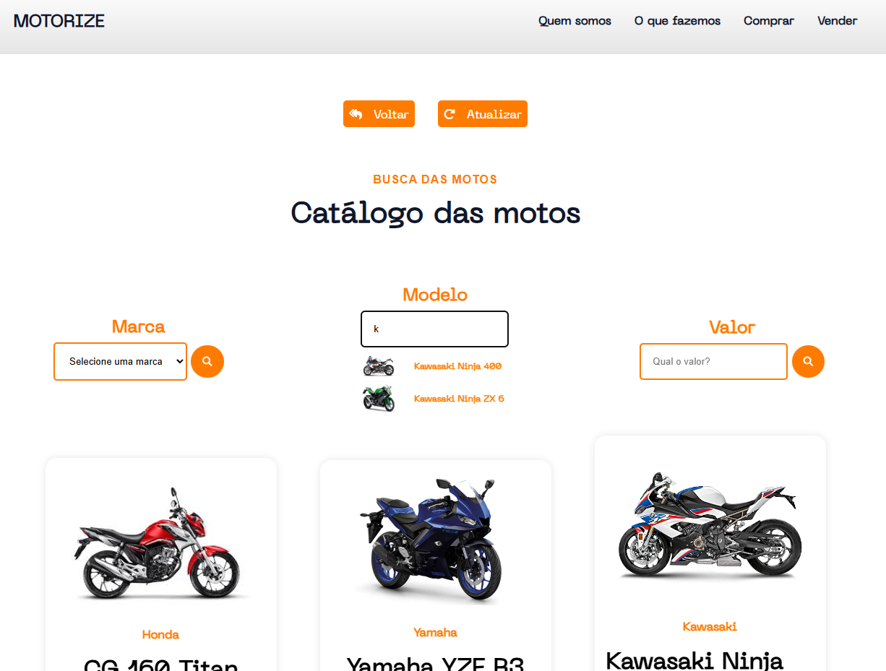

<h2 align = "center" fontSize="60px">
  Esse é um sistema CRUD para um modelo de loja de motos
</h2>

<div align="center">
  
</div>

  ## :rocket: Tecnologias Usadas
  
  -  [PHP](https://www.php.net/)
  -  [MySql](https://www.mysql.com/)
  -  CSS
  -  JavaScript
  -  HTML

  ## 💻 Sobre o projeto
  Se trata de uma concesionaria de motos fictícia onde os compradores podem interagir com o catálogo de motos cadastradas ou adicionar suas motos a venda se assemelhando com o modelo da [WebMotors](https://www.webmotors.com.br/).
  
  ### Funcionalidades

- [x] **Criar**: Usuário pode criar novos itens

- [x] **Buscar**: Usuário pode navegar pelos itens ja adicionados de uma forma dinâmica

- [x] **Editar**: Usuário pode manipular as informações dos itens

- [x] **Deletar**: Usuário pode deletar os itens

<div align="center">
  
</div>

## :muscle: Contribuir

Faça o `fork` e clone o projeto a partir do seu usuário.

```bash
# Clonando projeto
$ git clone https://github.com/SEU-NOME-DE-USUARIO/Motorize-CRUD.git

# Criando um branch
$ git branch minha-alteracao

# Acessando o novo branch
$ git checkout -b minha-alteracao

# Adicionando os arquivos alterados
$ git add .

# Criando commit e a mensagem
$ git commit -m "Corrigindo...."

# Enviando alterações para o brach
$ git push origin minha-alteracao
```
Você deve navegar até o seu repositório onde fez o fork e clicar no botão *New pull request* no lado esquerdo da página.
